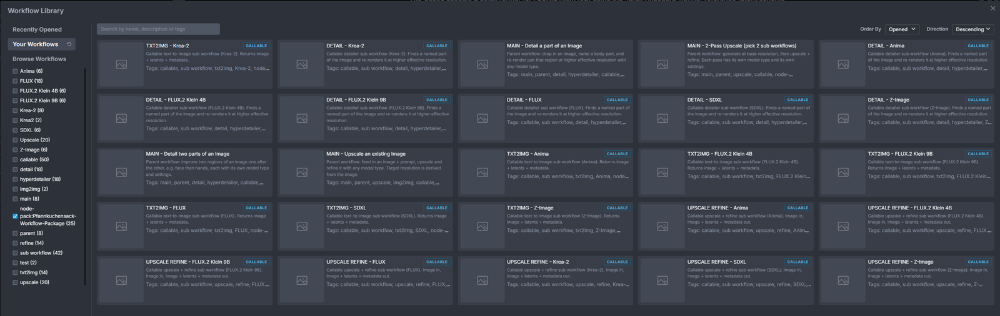
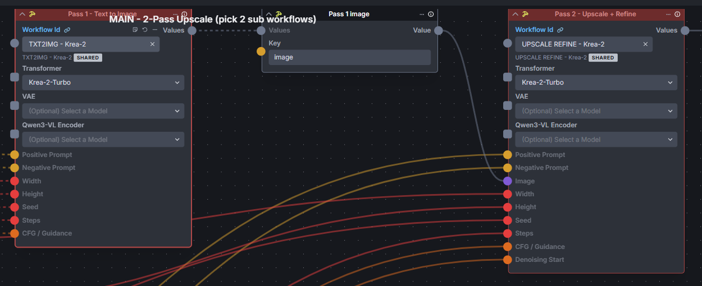
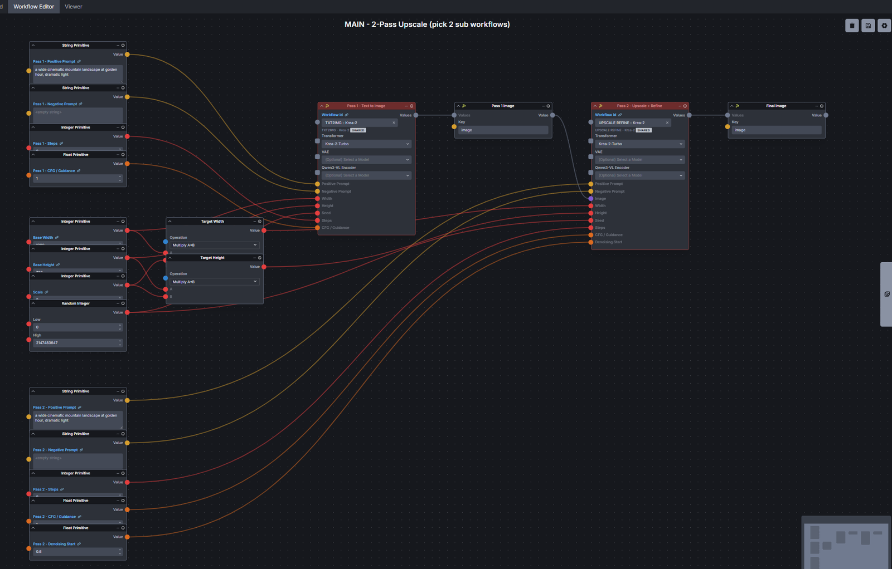
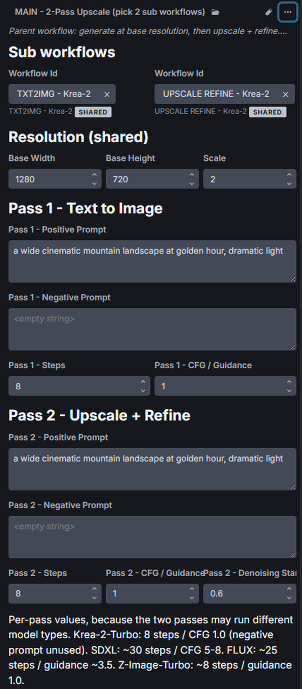

# Pfannkuchensacks Workflow Package

A collection of composable workflows for InvokeAI. Installing this node pack imports all
of them into your workflow library automatically.

## Install

Node Manager → *Install Node Pack* → *Git Repository URL* → paste this repo's URL.

All 25 workflows land in your library, tagged `node-pack:Pfannkuchensack-Workflow-Package`:

The pack ships one trivial node (**Pfannis Dummy Node**, a string passthrough). It exists
because InvokeAI only accepts a node pack that contains an importable `__init__.py` — the
workflows are the actual content.

## One-time setup after installing

**Open each `MAIN - …` workflow once and pick the sub workflow on every Call Saved Workflow
node** (Pass 1, Pass 2, Detail, …), then save.

Picking the workflow in the `Workflow Id` field makes that sub workflow's model fields appear on
the call node. Set all of them, not just `Transformer`: **VAE** and the **text encoder** are marked
optional, but leaving them empty falls back to whatever the selected checkpoint happens to carry —
and a checkpoint that ships neither will fail at run time rather than at connect time.

What you never have to touch is the wiring. The connections into the call node — prompt, width,
height, seed, steps, CFG — ship inside the MAIN file and survive both the import and a later change
of sub workflow. Note how Pass 2 carries two inputs Pass 1 does not: `Image` and `Denoising Start`.

Importing always assigns fresh workflow IDs — InvokeAI drops the `id` from the file and
generates a new UUID per workflow — so the sub workflow a call node points at cannot be
shipped in the file. Until you pick one, the call node has no workflow selected.

What it does *not* cost you is the wiring: the field templates for the exposed inputs ship
inside the MAIN files, so all connections into the call nodes survive the import and stay
put when you pick the sub workflow. You only choose the workflow; you never rewire.

## What you get

Four top-level workflows you run directly:

| Workflow | What it does |
|---|---|
| `MAIN - 2-Pass Upscale` | Generate at a base resolution, then upscale + refine. Each pass picks its own model type. |
| `MAIN - Upscale an existing Image` | Feed in an image, upscale + refine it. Target size is derived from the image. |
| `MAIN - Detail a part of an Image` | Name a body part, re-render just that region at higher effective resolution. |
| `MAIN - Detail two parts of an Image` | Same, twice in sequence — e.g. face, then hands. |

…and 21 callable sub workflows, three per model base, used by the MAINs through the
**Call Saved Workflow** node:

| | SDXL | FLUX | Z-Image | Krea-2 | Anima | Klein 9B | Klein 4B |
|---|---|---|---|---|---|---|---|
| `TXT2IMG - X` | ✓ | ✓ | ✓ | ✓ | ✓ | ✓ | ✓ |
| `UPSCALE REFINE - X` | ✓ | ✓ | ✓ | ✓ | ✓ | ✓ | ✓ |
| `DETAIL - X` | ✓ | ✓ | ✓ | ✓ | ✓ | ✓ | ✓ |

Each sub workflow returns `image`, `latents` and `metadata`.

The MAINs stay small on purpose: they hold the exposed settings and two call nodes, while the
model-specific work lives in the sub workflows.

## The point of the split

Every sub workflow of the same role exposes **the same inputs under the same node ids**.
Switching the workflow on a Call Saved Workflow node therefore keeps the existing wiring —
you swap SDXL for Krea-2 with one dropdown, without rebuilding the graph.

That only holds within a role. Putting a `TXT2IMG` workflow into a slot that expects an
`UPSCALE REFINE` drops the `image` and `denoising_start` connections, because those fields
do not exist there — and switching back does **not** restore them. Keep Pass 1 on
`TXT2IMG - …` and Pass 2 on `UPSCALE REFINE - …`.

## Settings that matter

Steps and CFG are model-specific, which is why the MAINs expose them per pass:

| Model | Steps | CFG / Guidance |
|---|---|---|
| SDXL | ~30 | 5–8 |
| Krea-2-Turbo | 8 | 1.0 (negative prompt is ignored) |
| Krea-2-Raw | ~28 | ~4.5 |
| FLUX | ~25 | guidance ~3.5 |
| Z-Image-Turbo | ~8 | 1.0 |

Keep resolutions a multiple of **16**. Several denoise nodes declare `multiple_of=16`, and
the 2×2 patch packing used by the Qwen-Image VAE (Krea-2, Anima) requires it.

## Notes

- The model is selected *inside* each sub workflow and appears on the call node once a
  workflow is picked.
- `DETAIL - …` uses Grounding DINO + Segment Anything. "Detect" is a free text prompt, so
  anything the detector can name works — not just body parts.
- Mixing model types across passes costs one model load per switch. Staying on one base
  for both passes is considerably faster.
- `MAIN - …` workflows have no `workflow_return` node, so they are correctly reported as
  not callable from another workflow. They are the top of the chain.
